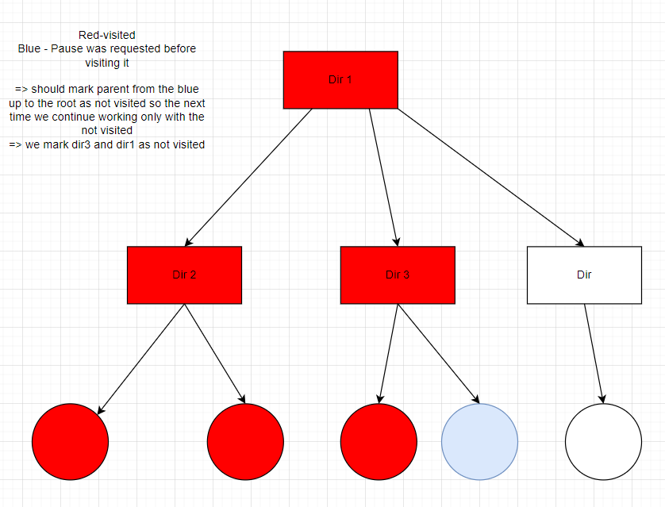

## Homework 3

Task for this homework - File system checksum - HW3_Task.pdf

## Pausing logic

- Stop requested is checked after every processed entity
- If the whole file system is just one file => no stop functionaliy
- If we have something better, stop is invoked after processing the current/next file

## Known issues

- Currently works only for windows shortcuts
- When traversing and following shortcuts the result percentage are inconsistent because of the size of the referred files by the shortcuts
- Missing the functionality with the two threads communicating